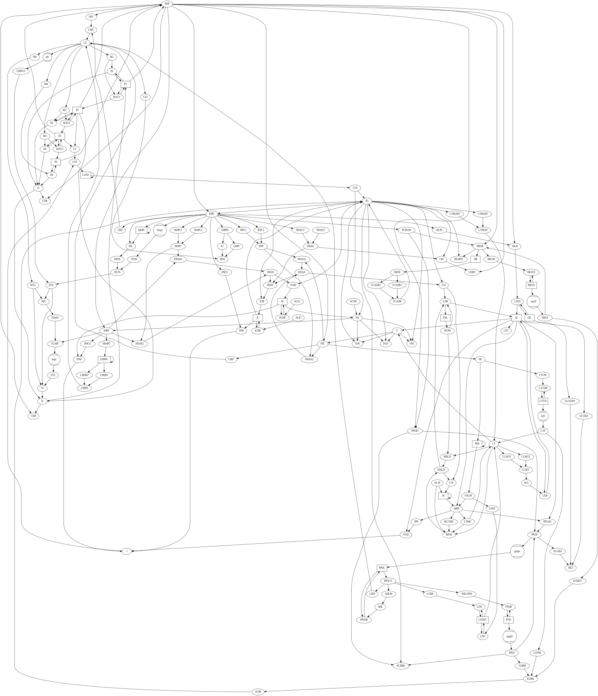

# MyWorld3

A new implementation of the [World3](https://en.wikipedia.org/wiki/World3) model

```
cd MyWorld3
python world3_run.py 1
# Where '1' is the scenario, values 1-9
```

## Model graph

A [graphviz](https://graphviz.org/) (dot) graph of the model can be
generated from code. For a better view, right-click on the image and
bring it up in a new tab (on Firefox or Chrome). On Chrome you can
then zoom with `ctrl-scroll-wheel`, and grab and move with
`shift-left-click`.



Re-generate the model graph:
```
# Install graphviz. On Ubuntu:
sudo apt install graphviz
# then
python MyWorld3/world3_graphviz.py | dot -Tsvg > model.svg
```
